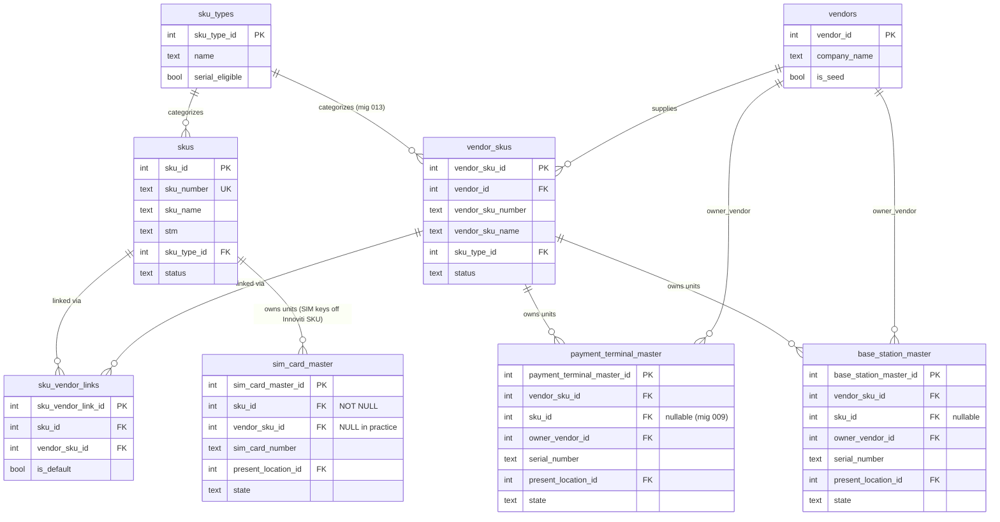
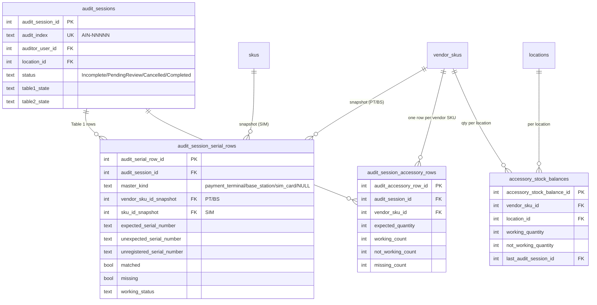

# SKU & Audit Schema Map

A reference for the SKU-related tables and how the Phase 3 audit tables hang off
them. Source of truth is the migrations under `code/backend/src/migrations/`; this
doc is a navigational aid, not a substitute.

## Why the shape matters

A scanned serial is **unique only within a Vendor SKU** — migration `009` puts
`UNIQUE(vendor_sku_id, serial_number)` on Payment Terminal / Base Station masters.
Two different Vendor SKUs (e.g. "PAX 3003" and "MOV 2500", or the *same* model
supplied by two vendors) can carry the same serial string. That is why Table 1
scanning is **pick the Vendor SKU first, then enter the serial** — the
`(vendor_sku_id, serial)` pair is the disambiguation key. SIM cards are the
exception: they anchor to the Innoviti `sku_id` (their `vendor_sku_id` is `NULL`
in practice), so SIMs are picked by their Innoviti SKU.

## Core SKU schema



### ASCII view

```
                         ┌──────────────┐
                         │  sku_types   │  name, serial_eligible
                         │ (PK type_id) │  Payment Terminal / Base Station /
                         └──────┬───────┘  SIM Card (serial=T); accessories (serial=F)
              categorizes ┌─────┴───────────┐
                          ▼                 ▼
                   ┌────────────┐     ┌──────────────┐      ┌───────────┐
                   │   skus     │     │ vendor_skus  │◄─────│  vendors  │ supplies
                   │ (Innoviti) │     │ (per-vendor) │      │(PK ven_id)│
                   │ PK sku_id  │     │ PK v_sku_id  │      └─────┬─────┘
                   │ sku_number │     │ v_sku_number │            │ owner_vendor_id
                   │  (UNIQUE)  │     │ UNIQUE(ven_id,│           │ (PT/BS only)
                   └─────┬──────┘     │   v_sku_num) │            │
                         │            └──────┬───────┘            │
            many-to-many │                   │                    │
                  ┌──────┴───────────────────┴──────┐             │
                  │        sku_vendor_links          │            │
                  │  (sku_id, vendor_sku_id,         │            │
                  │   is_default)  -- ≤1 default/sku │            │
                  └──────────────────────────────────┘            │
                                                                  │
   ── physical-unit masters ──────────────────────────────────────┘

   payment_terminal_master      base_station_master       sim_card_master
   ─ vendor_sku_id  ──┐         ─ vendor_sku_id  ──┐       ─ sku_id  (NOT NULL) ──┐
   ─ sku_id (nullable)│         ─ sku_id (nullable)│       ─ vendor_sku_id (NULL) │
   ─ owner_vendor_id  │         ─ owner_vendor_id  │       ─ sim_card_number      │
   ─ serial_number    │         ─ serial_number    │                             │
   UNIQUE(vendor_sku_id,│       UNIQUE(vendor_sku_id,│      UNIQUE(sku_id,         │
          serial_number)        serial_number)             sim_card_number)
            ▲                                                      ▲
            └── serial unique *within* a vendor SKU ──────────────┘
                (PAX 3003 vs MOV 2500 can share "12345")  ← the disambiguation key
```

## Audit extension (Phase 3)

The audit tables reference SKUs/Vendor SKUs and **snapshot** the display fields so
a completed PAR survives later renames or reassignments.



### How a Table 1 scan resolves (target-scoped)

```
ASO picks a target (Vendor SKU  ->  vendor_sku_id  | SIM SKU -> sku_id)
then enters a serial. All matching is scoped to that target's key:

  1. duplicate guard  : same serial already counted for THIS target?      -> 409
  2. expected match   : unmatched seeded row, same key + serial?          -> tick (matched)
  3. master search    : (vendor_sku_id|sku_id, serial) in its one master? -> Unexpected row
                          + remark "Wrong Location" / "Recovered"
  4. unregistered     : none of the above                                 -> Unregistered row
                          (still snapshots the chosen Vendor/SIM SKU)
```

Key columns:
- `audit_session_serial_rows.vendor_sku_id_snapshot` — PT/BS match key.
- `audit_session_serial_rows.sku_id_snapshot` — SIM match key.
- Exactly one of `expected_/unexpected_/unregistered_serial_number` is set per row
  (`chk_serial_row_category`).

## Field cheat-sheet

| Table | Key uniqueness | Anchor to SKU world |
|-------|----------------|---------------------|
| `skus` | `sku_number` UNIQUE | `sku_type_id` → `sku_types` |
| `vendor_skus` | `(vendor_id, vendor_sku_number)` UNIQUE | `vendor_id` → `vendors`, `sku_type_id` → `sku_types` |
| `sku_vendor_links` | `(sku_id, vendor_sku_id)` UNIQUE; ≤1 `is_default` per `sku_id` | M:N between `skus` and `vendor_skus` |
| `payment_terminal_master` | `(vendor_sku_id, serial_number)` UNIQUE | `vendor_sku_id`, `sku_id` (nullable), `owner_vendor_id` |
| `base_station_master` | `(vendor_sku_id, serial_number)` UNIQUE | same as PT |
| `sim_card_master` | `(sku_id, sim_card_number)` UNIQUE | `sku_id` (NOT NULL); `vendor_sku_id` NULL in practice |
| `accessory_stock_balances` | `(vendor_sku_id, location_id)` UNIQUE | `vendor_sku_id` |
| `audit_session_accessory_rows` | `(audit_session_id, vendor_sku_id)` UNIQUE | `vendor_sku_id` |
| `audit_session_serial_rows` | — (snapshot rows) | `vendor_sku_id_snapshot` / `sku_id_snapshot` |
